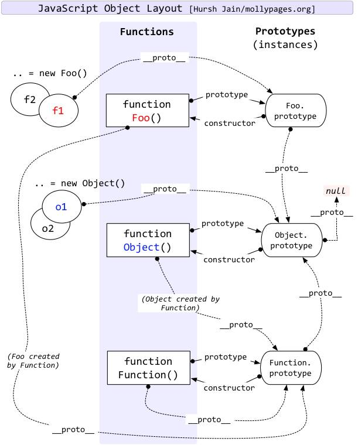

# 知识点 一
```js
Object.prototype.__proto__ === null
Function.prototype.__proto__ === Object.prototype
Object.__proto__ === Function.prototype
```


*******************************************************************************************************************************************************************************************
# 知识点 二
按照如下要求实现Person 和 Student 对象
 a)Student 继承Person 
 b)Person 包含一个实例变量 name， 包含一个方法 printName
 c)Student 包含一个实例变量 score， 包含一个实例方法printScore
 d)所有Person和Student对象之间共享一个方法

es6类写法
```js
    class Person {
        constructor(name) {
            this.name = name;
        }
        printName() {
            console.log('This is printName');
        }
        commonMethods(){
            console.log('我是共享方法');
        }
    }

    class Student extends Person {
        constructor(name, score) {
            super(name);
            this.score = score;
        }
        printScore() {
            console.log('This is printScore');
        }
    }

    let stu = new Student('小红');
    let person = new Person('小紫');
    console.log(stu.commonMethods===person.commonMethods);//true
```

原生写法
```js
    function Person (name){
        this.name = name;
        this.printName=function() {
            console.log('This is printName');
        };
    }
    Person.prototype.commonMethods=function(){
        console.log('我是共享方法');
    };

    function Student(name, score) {
        Person.call(this,name);
        this.score = score;
        this.printScore=function() {
            console.log('This is printScore');
        }
    }
    Student.prototype = new Person();
    let person = new Person('小紫',80);
    let stu = new Student('小红',100);
    console.log(stu.printName===person.printName);//false
    console.log(stu.commonMethods===person.commonMethods);//true

```

*******************************************************************************************************************************************************************************************
# 知识点 三
```js
var F = function () {}
Object.prototype.a = function () {}
Function.prototype.b = function () {}

var f = new F()
// 请问f有方法a  方法b吗
```

f.__proto__ === F.prototype
F.prototype.__proto__ === Object.prototype

f的__proto__指向F.prototype，F.prototype.__proto__指向Object.prototype，所以f 可以取到a方法， 由于f的原型链上没经过Function.prototype，所以取不到b方法。

由于构造函数F是由Function new出来的，所以F.__proto__指向Function.prototype，所以F函数可以取到b方法。

*******************************************************************************************************************************************************************************************


# 知识点 四
```js
function Person(){}

let p1 = new Person()
let p2 = new Person()
let obj = {}
//写出 p1  p2  Person  Function   obj   Object等的原型链
```
* p1:      __proto__ :  Person.prototype       

* p2:      __proto__ :  Person.prototype 

* Person  :         __proto__： Function.prototype，    prototype： Person.prototype

* Person.prototype ：         __proto__ ： Object.prototype ，  constructor： Person

* Function：       __proto__ ： Function.prototype，   prototype： Function.prototype

* Function.Prototype：     __proto__ ：  Object.prototype ，   constructor：  Function

* obj：    __proto__ ： Object.prototype

* Object：   __proto__ ： Function.prototype  ，   prototype：  Object.prototype

* Object.prototype：    __proto__ ：  null  ，   constructor  ：  Object

* Object.__proto__  === Function.prototype
> Object是对象的构造函数，那么它也是一个函数，当然它的__proto__也是指向Function.prototype

*******************************************************************************************************************************************************************************************


var a = new Preson()

a.__proto__== Person.prototype
a.__proto__.__proto__ == Object.prototype
a.__proto__.__proto__.__proto__ == null

Function.__proto__ === Function.prototype


```js
		var a = function () { this.b = 3; }
		var c = new a();
		a.prototype.b = 9;
		var b = 7;
		a();
		console.log(b);
		console.log(c.b); 
```