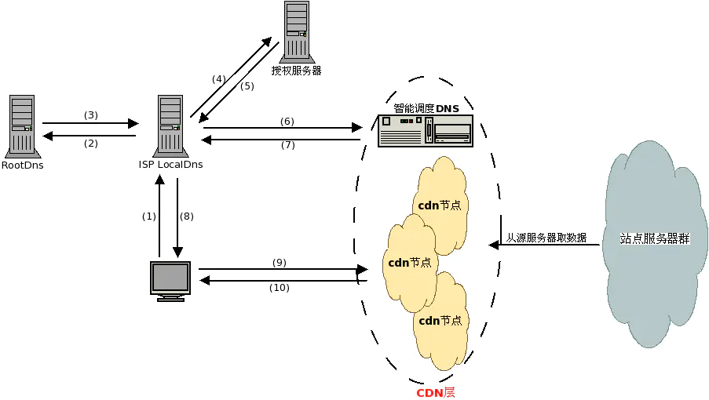

# CDN实现原理

## CDN对网络的优化作用主要体现在如下几个方面
- 解决服务器端的“第一公里”问题
- 缓解甚至消除了不同运营商之间互联的瓶颈造成的影响
- 减轻了各省的出口带宽压力
- 缓解了骨干网的压力
- 优化了网上热点内容的分布

## 二、CDN工作原理

1. 用户输入访问的域名,操作系统向 LocalDns 查询域名的ip地址. 
2. LocalDns向 ROOT DNS 查询域名的授权服务器(这里假设LocalDns缓存过期)
3. ROOT DNS将域名授权dns记录回应给 LocalDns
4. LocalDns得到域名的授权dns记录后,继续向域名授权dns查询域名的ip地址
5. 域名授权dns 查询域名记录后(一般是CNAME)，回应给 LocalDns
6. LocalDns 得到域名记录后,向智能调度DNS查询域名的ip地址
7. 智能调度DNS 根据一定的算法和策略(比如静态拓扑，容量等),将最适合的CDN节点ip地址回应给 LocalDns
8. LocalDns 将得到的域名ip地址，回应给 用户端
9. 用户得到域名ip地址后，访问站点服务器
10. CDN节点服务器应答请求，将内容返回给客户端.(缓存服务器一方面在本地进行保存，以备以后使用，二方面把获取的数据返回给客户端，完成数据服务过程)