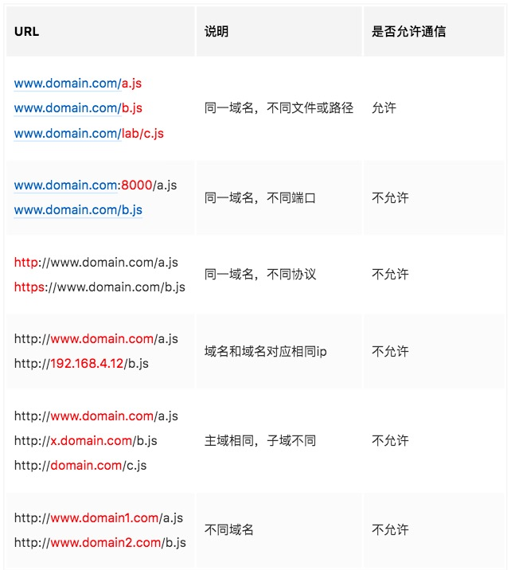

# 跨域

## 一 什么是跨域？
> 在前端领域中，跨域是指浏览器允许向服务器发送跨域请求，从而克服Ajax只能同源使用的限制。

### 什么是同源策略？
同源策略是一种约定，由Netscape公司1995年引入浏览器，它是浏览器最核心也最基本的安全功能，如果缺少了同源策略，浏览器很容易受到XSS、CSFR等攻击。所谓同源是指"协议+域名+端口"三者相同，即便两个不同的域名指向同一个ip地址，也非同源。

**同源策略限制以下几种行为**：

* Cookie、LocalStorage 和 IndexDB 无法读取
* DOM和JS对象无法获得
* AJAX 请求不能发送


## 二、常见的跨域场景


<!--  -->
## 三、9种跨域解决方案

### 1、JSONP跨域
jsonp的原理就是利用<script>标签没有跨域限制，通过<script>标签src属性，发送带有callback参数的GET请求，服务端将接口返回数据拼凑到callback函数中，返回给浏览器，浏览器解析执行，从而前端拿到callback函数返回的数据。

原生JS实现：

 <script>
    var script = document.createElement('script');
    script.type = 'text/javascript';

    // 传参一个回调函数名给后端，方便后端返回时执行这个在前端定义的回调函数
    script.src = 'http://www.domain2.com:8080/login?user=admin&callback=handleCallback';
    document.head.appendChild(script);

    // 回调执行函数
    function handleCallback(res) {
        alert(JSON.stringify(res));
    }
 </script>


服务端返回如下（返回时即执行全局函数）：

```js
    handleCallback({"success": true, "user": "admin"})
```
> jsonp的缺点：只能发送get一种请求。

### 2、跨域资源共享（CORS）


### 3、nginx代理跨域
> nginx代理跨域，实质和CORS跨域原理一样，通过配置文件设置请求响应头Access-Control-Allow-Origin...等字段。

实现思路：通过Nginx配置一个代理服务器域名与domain1相同，端口不同）做跳板机，反向代理访问domain2接口，并且可以顺便修改cookie中domain信息，方便当前域cookie写入，实现跨域访问。

nginx具体配置：
```js
    #proxy服务器
    server {
        listen       81;
        server_name  www.domain1.com;

        location / {
            proxy_pass   http://www.domain2.com:8080;  #反向代理
            proxy_cookie_domain www.domain2.com www.domain1.com; #修改cookie里域名
            index  index.html index.htm;

            # 当用webpack-dev-server等中间件代理接口访问nignx时，此时无浏览器参与，故没有同源限制，下面的跨域配置可不启用
            add_header Access-Control-Allow-Origin http://www.domain1.com;  #当前端只跨域不带cookie时，可为*
            add_header Access-Control-Allow-Credentials true; //携带cookie，需要设置此参数
        }
    }
```


### 4、nodejs中间件代理跨域

### 5、document.domain + iframe跨域

此方案仅限主域相同，子域不同的跨域应用场景。实现原理：两个页面都通过js强制设置document.domain为基础主域，就实现了同域。

1）父窗口：(www.domain.com/a.html)

```html
    <iframe id="iframe" src="http://child.domain.com/b.html"></iframe>
    <script>
        document.domain = 'domain.com';
        var user = 'admin';

        var ifr = document.getElementById('iframe');
        var doc = ifr.contentDocument || ifr.contentWindow.document;
        // 在这里操纵b.html
        alert(doc.getElementsByTagName("h1")[0].childNodes[0].nodeValue);
    </script>
```

2）子窗口：(child.domain.com/b.html)
```html
    <script>
        document.domain = 'domain.com';
        // 获取父窗口中变量
        console.log('get js data from parent ---> ' + window.parent.user);
    </script>
```

### 6、location.hash + iframe跨域

### 7、window.name + iframe跨域

window.name属性的独特之处：name值在不同的页面（甚至不同域名）加载后依旧存在，并且可以支持非常长的 name 值（2MB）。

1）a.html：(www.domain1.com/a.html)

```js
    var proxy = function(url, callback) {
        var state = 0;
        var iframe = document.createElement('iframe');

        // 加载跨域页面
        iframe.src = url;

        // onload事件会触发2次，第1次加载跨域页，并留存数据于window.name
        iframe.onload = function() {
            if (state === 1) {
                // 第2次onload(同域proxy页)成功后，读取同域window.name中数据
                callback(iframe.contentWindow.name);
                destoryFrame();

            } else if (state === 0) {
                // 第1次onload(跨域页)成功后，切换到同域代理页面
                iframe.contentWindow.location = 'http://www.domain1.com/proxy.html';
                state = 1;
            }
        };

        document.body.appendChild(iframe);

        // 获取数据以后销毁这个iframe，释放内存；这也保证了安全（不被其他域frame js访问）
        function destoryFrame() {
            iframe.contentWindow.document.write('');
            iframe.contentWindow.close();
            document.body.removeChild(iframe);
        }
    };

    // 请求跨域b页面数据
    proxy('http://www.domain2.com/b.html', function(data){
        alert(data);
    });

```

2）proxy.html：(www.domain1.com/proxy.html)
  中间代理页，与a.html同域，内容为空即可。

3）b.html：(www.domain2.com/b.html)

```html
    <script>
        window.name = 'This is domain2 data!';
    </script>
```

通过iframe的src属性由外域转向本地域，跨域数据即由iframe的window.name从外域传递到本地域。这个就巧妙地绕过了浏览器的跨域访问限制，但同时它又是**安全操作**。

### 8、postMessage跨域
> postMessage是HTML5 XMLHttpRequest Level 2中的API，且是为数不多可以跨域操作的window属性之一，它可用于解决以下方面的问题：

* 页面和其打开的新窗口的数据传递
* 多窗口之间消息传递
* 页面与嵌套的iframe消息传递
* 上面三个场景的跨域数据传递

用法：postMessage(data,origin)方法接受两个参数：

- data： html5规范支持任意基本类型或可复制的对象，但部分浏览器只支持字符串，所以传参时最好用JSON.stringify()序列化。
- origin： 协议+主机+端口号，也可以设置为"*"，表示可以传递给任意窗口，如果要指定和当前窗口同源的话设置为"/"。

1）a.html：(www.domain1.com/a.html)
```js
    <iframe id="iframe" src="http://www.domain2.com/b.html" style="display:none;"></iframe>
    <script>       
        var iframe = document.getElementById('iframe');
        iframe.onload = function() {
            var data = {
                name: 'aym'
            };
            // 向domain2传送跨域数据
            iframe.contentWindow.postMessage(JSON.stringify(data), 'http://www.domain2.com');
        };

        // 接受domain2返回数据
        window.addEventListener('message', function(e) {
            alert('data from domain2 ---> ' + e.data);
        }, false);
    </script>
```

2）b.html：(www.domain2.com/b.html)

```js
<script>
    // 接收domain1的数据
    window.addEventListener('message', function(e) {
        alert('data from domain1 ---> ' + e.data);

        var data = JSON.parse(e.data);
        if (data) {
            data.number = 16;

            // 处理后再发回domain1
            window.parent.postMessage(JSON.stringify(data), 'http://www.domain1.com');
        }
    }, false);
</script>
```


### 9、WebSocket协议跨域


# 小结

  以上就是9种常见的跨域解决方案，jsonp（只支持get请求，支持老的IE浏览器）适合加载不同域名的js、css，img等静态资源；CORS（支持所有类型的HTTP请求，但浏览器IE10以下不支持）适合做ajax各种跨域请求；Nginx代理跨域和nodejs中间件跨域原理都相似，都是搭建一个服务器，直接在服务器端请求HTTP接口，这适合前后端分离的前端项目调后端接口。document.domain+iframe适合主域名相同，子域名不同的跨域请求。postMessage、websocket都是HTML5新特性，兼容性不是很好，只适用于主流浏览器和IE10+。
  这么多的跨域方案，没有最好，只有最合适的，根据具体的使用场景选择跨域方案。希望这篇博文能带给大家一点帮助~~


[参考资料](https://juejin.im/post/5d1ecb96f265da1b6d404433#heading-4)