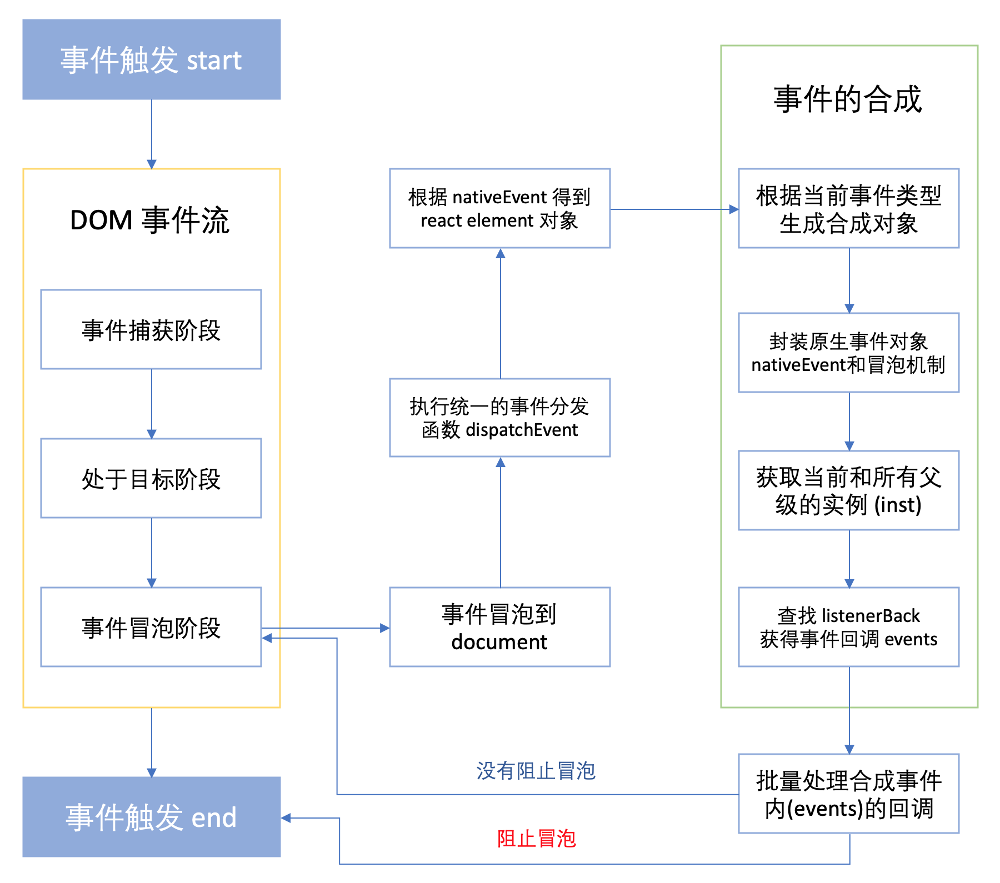

# React：事件机制原理

React 合成事件和原生 DOM 事件的主要区别:

（1）React 组件上声明的事件没有绑定在 React 组件对应的原生 DOM 节点上。

（2）React 利用事件委托机制，将几乎所有事件的触发代理（delegate）在 document 节点上，事件对象(event)是合成对象(SyntheticEvent)，不是原生事件对象，但通过 nativeEvent 属性访问原生事件对象。

（3）由于 React 的事件委托机制，React 组件对应的原生 DOM 节点上的事件触发时机总是在 React 组件上的事件之前。

其实react并不是将click事件绑定到了div的真实DOM上，而是在document处监听了所有的事件，当事件发生并且冒泡到document处的时候，React将事件内容封装并交由真正的处理函数运行。这样的方式不仅仅减少了内存的消耗，还能在组件挂在销毁时统一订阅和移除事件。