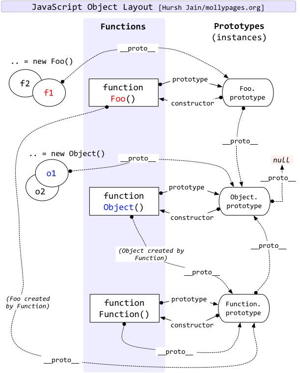

# 面试题一
```js
Object.prototype.__proto__ === null
Function.prototype.__proto__ === Object.prototype
Object.__proto__ === Function.prototype
```


# 面试题二
按照如下要求实现Person 和 Student 对象
 a)Student 继承Person 
 b)Person 包含一个实例变量 name， 包含一个方法 printName
 c)Student 包含一个实例变量 score， 包含一个实例方法printScore
 d)所有Person和Student对象之间共享一个方法

es6类写法
```js
    class Person {
        constructor(name) {
            this.name = name;
        }
        printName() {
            console.log('This is printName');
        }
        commonMethods(){
            console.log('我是共享方法');
        }
    }

    class Student extends Person {
        constructor(name, score) {
            super(name);
            this.score = score;
        }
        printScore() {
            console.log('This is printScore');
        }
    }

    let stu = new Student('小红');
    let person = new Person('小紫');
    console.log(stu.commonMethods===person.commonMethods);//true
```

原生写法
```js
    function Person (name){
        this.name = name;
        this.printName=function() {
            console.log('This is printName');
        };
    }
    Person.prototype.commonMethods=function(){
        console.log('我是共享方法');
    };

    function Student(name, score) {
        Person.call(this,name);
        this.score = score;
        this.printScore=function() {
            console.log('This is printScore');
        }
    }
    Student.prototype = new Person();
    let person = new Person('小紫',80);
    let stu = new Student('小红',100);
    console.log(stu.printName===person.printName);//false
    console.log(stu.commonMethods===person.commonMethods);//true

```
