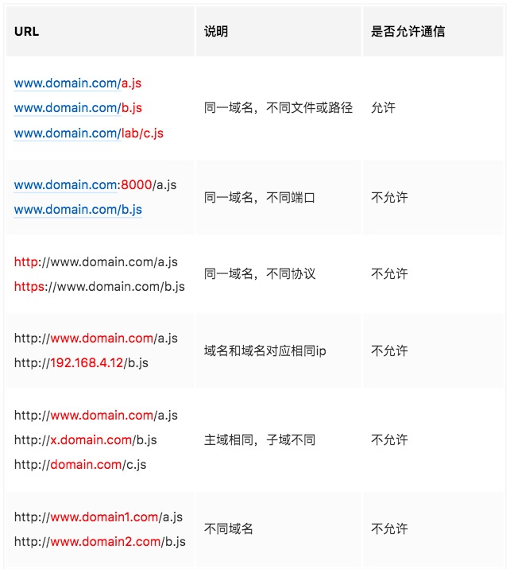

# 跨域

## 一 什么是跨域？
> 在前端领域中，跨域是指浏览器允许向服务器发送跨域请求，从而克服Ajax只能同源使用的限制。

### 什么是同源策略？
同源策略是一种约定，由Netscape公司1995年引入浏览器，它是浏览器最核心也最基本的安全功能，如果缺少了同源策略，浏览器很容易受到XSS、CSFR等攻击。所谓同源是指"协议+域名+端口"三者相同，即便两个不同的域名指向同一个ip地址，也非同源。

**同源策略限制以下几种行为**：

* Cookie、LocalStorage 和 IndexDB 无法读取
* DOM和JS对象无法获得
* AJAX 请求不能发送

## 二、常见的跨域场景

## 三、9种跨域解决方案

### 1、JSONP跨域
jsonp的原理就是利用
