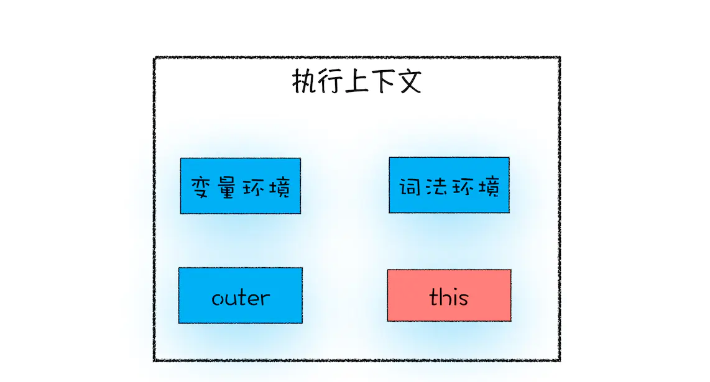

# 箭头函数和this指向

## this：
> this 是和执行上下文绑定的，也就是说每个执行上下文中都有一个 this。


上图中 outer 是在变量环境里面的，为了方便看
- 我们都知道 js 在编译阶段 创建执行上下文
- 在每个执行上下文的变量环境中，都包含了一个外部引用，用来指向外部的执行上下文，我们把这个外部引用称为 outer

## 全局执行上下文中的 this：
> 全局执行上下文中的 this 是指向 window 对象的。这也是 this 和作用域链的唯一交点，作用域链的最底端包含了 window 对象，全局执行上下文中的 this 也是指向 window 对象

## 函数中的this：
```js
    function foo(){
    console.log(this)
    }
    foo()
    // 也是指向window
```
那能不能设置执行上下文中的 this 来指向其他对象呢？ 肯定是可以的

1、通过函数的 call 方法设置：
```js
    let bar = {
        myName : "极客邦",
    test1 : 1
    }
    function foo(){
        this.myName = "极客时间"
    }
    foo.call(bar)
    console.log(bar)   // {myName: "极客时间", test1: 1}
    console.log(myName)   // myName is not defined
```

2、通过对象调用方法设置：
> 要改变函数执行上下文中的 this 指向，除了通过函数的 call 方法来实现外，还可以通过对象调用的方式
```js
    var myObj = {
    name : "极客时间", 
    showThis: function(){
        console.log(this)
    }
    }
    myObj.showThis()  // {name: "极客时间", showThis: ƒ}
```
使用对象来调用其内部的一个方法，该方法的 this 是指向对象本身的。
```js
    var myObj = {
    name : "极客时间",
    showThis: function(){
        this.name = "极客邦"
        console.log(this)
    }
    }
    var foo = myObj.showThis
    foo()
    //你会发现 this 又指向了全局 window 对象。
```
- 在全局环境中调用一个函数，函数内部的 this 指向的是全局变量 window。
- 通过一个对象来调用其内部的一个方法，该方法的执行上下文中的 this 指向对象本身。

3. 通过构造函数中设置：
```js
    function CreateObj(){ 
        this.name = "极客时间"
        console.log(this)   // CreateObj {name: "极客时间"}
    }
    var myObj = new CreateObj()

    new CreateObj() 过程：
    1、首先创建了一个空对象 tempObj；
    2、接着调用 CreateObj.call 方法，并将 tempObj 作为 call 方法的参数，这样当 CreateObj 的执行上下文创建时，它的 this 就指向了 tempObj 对象；
    3、然后执行 CreateObj 函数，此时的 CreateObj 函数执行上下文中的 this 指向了 tempObj 对象；
    4、最后返回 tempObj 对象。
```

### 嵌套函数中的 this 不会从外层函数中继承
```js
    var myObj = {
    name : "极客时间", 
    showThis: function(){
        console.log(this) 
        function bar(){console.log(this)}
        bar()
    }
    }
    myObj.showThis()
    //函数 bar 中的 this 指向的是全局 window 对象，
    // 而函数 showThis 中的 this 指向的是 myObj 对象
```

那怎么实现 bar 的this指向外层 myObj 呢？

```js
    var myObj = {
        name : "极客时间", 
        showThis: function(){
            console.log(this)
            var self = this
            function bar(){
                self.name = "极客邦"
            }
            bar()
        }
    }
    myObj.showThis()
    console.log(myObj.name)
    console.log(window.name)
```

本质是把 this 体系转换为了作用域的体系 。也可以使用 ES6 中的箭头函数来解决这个问题
```js
    var myObj = {
    name : "极客时间", 
    showThis: function(){
        console.log(this) // {name: "极客时间", showThis: ƒ}
        var bar = ()=>{
            this.name = "极客邦"
            console.log(this)  //  {name: "极客邦", showThis: ƒ}
        }
        bar()
    }
    }
    myObj.showThis()  
    console.log(myObj.name)   // 极客邦
    console.log(window.name)  //  ''
```
**因为 ES6 中的箭头函数并不会创建其自身的执行上下文，所以箭头函数中的 this 取决于它的外部函数**

- 当函数作为对象的方法调用时，函数中的 this 就是该对象；
- 当函数被正常调用时，在严格模式下，this 值是 undefined，非严格模式下 this 指向的是全局对象 window；
- 嵌套函数中的 this 不会继承外层函数的 this 值


## 下面说下 普通函数和箭头函数的区别：
箭头函数和普通函数的this：
## 1、this 指向不同：
- 普通函数this 指向 为方法调用的对象，可以通过bind，call，apply，改变this指向
- 箭头函数比函数表达式更简洁，箭头函数不会创建自己的this,它只会从自己的作用域链的上一层继承this。bind，call，apply只能调用传递参数，不可修改this指向
```js
    var obj = {
        a: 10,
        b: () => {
            console.log(this.a); // undefined
            console.log(this); // Window {postMessage: ƒ, blur: ƒ, focus: ƒ, close: ƒ, frames: Window, …}
        },
        c: function() {
            console.log(this.a); // 10
            console.log(this); // {a: 10, b: ƒ, c: ƒ}
        }
    }
    obj.b(); 
    obj.c();
```
> 箭头函数不绑定this，会捕获其所在的上下文的this值，作为自己的this值。任何方法都改变不了其指向
```js
    var obj = {
        a: 10,
        b: function(){
            console.log(this.a); //10
        },
        c: function() {
            return ()=>{
                console.log(this.a); //10
            }
        }
    }
    obj.b(); 
    obj.c()();
```
> 箭头函数通过 call() 或 apply() 方法调用一个函数时，只传入了一个参数，对 this 并没有影响。

#### 补充：call,aplly,bind:
它们在功能上是没有区别的，都是改变this的指向，它们的区别主要是在于方法的实现形式和参数传递上的不同。call和apply方法都是在调用之后立即执行的。而bind调用之后是一个函数，需要再调用一次才行
①：函数.call(对象,arg1,arg2....)
②：函数.apply(对象，[arg1,arg2,...])
③：var ss=函数.bind(对象,arg1,arg2,....)
```js
    let obj2 = {
        a: 10,
        b: function(n) {
            let f = (n) => n + this.a;
            return f(n);
        },
        c: function(n) {
            let f = (n) => n + this.a;
            let m = {
                a: 20
            };
            return f.call(m,n);
        }
    };
    console.log(obj2.b(1));  // 11
    console.log(obj2.c(1)); // 11
```

## 2、箭头函数没有原型
```js
    var a = ()=>{
        return 1;
    }

    function b(){
        return 2;
    }

    console.log(a.prototype);  // undefined
    console.log(b.prototype);   // {constructor: ƒ}
```

## 3、箭头函数不能绑定arguments，取而代之用rest参数...解决
```js
    function A(a){
        console.log(arguments);
    }
    A(1,2,3,4,5,8);
    // [1, 2, 3, 4, 5, 8, callee: ƒ, Symbol(Symbol.iterator): ƒ]
    let C = (...c) => {
        console.log(c);
    }
    C(3,82,32,11323);
    // [3, 82, 32, 11323]
```

## 4、箭头函数是匿名函数，不能作为构造函数，不能使用new
**无法实例化的原因**
- 没有自己的this，无法调用call，apply
- 没有prototype属性，而new命令执行的时候需要将构造函数的prototype赋值给新的对象的_proto

## 5、箭头函数不可以使用 yield 命令，因此箭头函数不能用作 Generator 函数。
## 6、函数体内的this对象（继承的），就是定义时所在的对象，而不是使用时所在的对象。