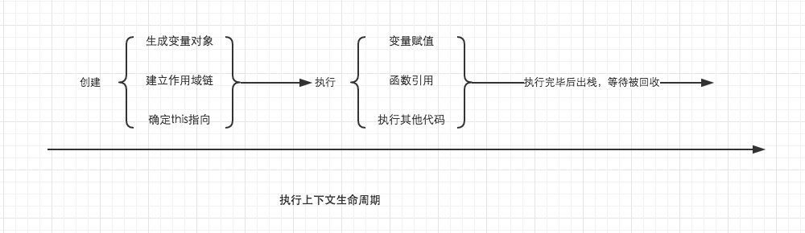

# 执行上下文
当代码运行时，会产生一个对应的执行环境，在这个环境中，所有变量会被事先提出来（变量提升），有的直接赋值，有的为默认值 undefined，代码从上往下开始执行，就叫做执行上下文。

## 在 JavaScript 的世界里，运行环境有三种，分别是：
1. 全局环境：代码首先进入的环境
2. 函数环境：函数被调用时执行的环境
3. eval函数：https://www.cnblogs.com/chaoguo1234/p/5384745.html（不常用）

## 执行上下文特点
1.单线程，在主进程上运行
2.同步执行，从上往下按顺序执行
3.全局上下文只有一个，浏览器关闭时会被弹出栈
4.函数的执行上下文没有数目限制
5.函数每被调用一次，都会产生一个新的执行上下文环境

## 执行上下文生命周期
