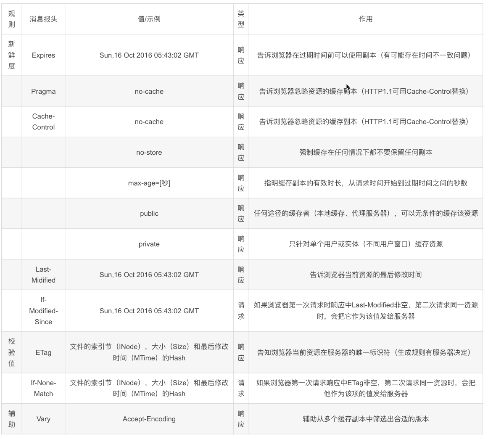
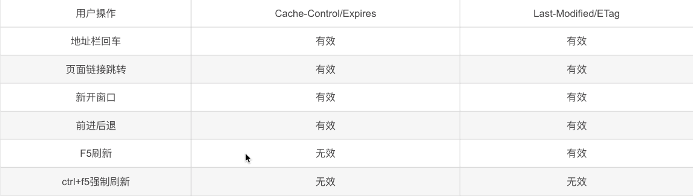
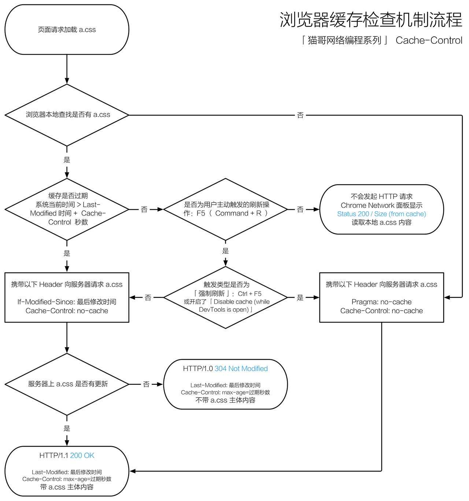

# HTTP缓存字段总结
>  HTTP控制缓存的字段主要包括Cache-Control/Pragma,Expires,Last-Modified/Etag。

## 1、Cache-Control/Pragma
```js
    这个HTTP Head字段用于指定所有缓存机制在整个请求/响应链中必须服从的指令，如果知道该页面是否为缓存，不仅可以控制浏览器，还可以控制和HTTP相关的缓存或代理服务器。它可以指定下列可选值：
    1、Public：所有内容都将被缓存，在响应头中设置
    2、Private：内容只缓存在私有缓存中，在响应头中设置
    3、no-cache：所有内容都不会被缓存，在请求头和响应头中设置
    4、no-store：所有内容都不会被缓存在缓存或Internet临时文件中，在响应头中设置
    5、must-revalidation/proxy-revalidation：如果缓存的内容失效，请求必须发送到服务器/代理以进行重新验证，在请求头中设置
    6、max-age=xxx：缓存的内容将在xxx秒后失效，这个选项只在HTTP1.1中可用，和Last-Modified一起使用时优先级较高，在响应头中设置

    Cache-Control请求字段可以被个浏览器很好的支持，而且优先级也比较高，它和其他一些请求字段（如Expires）同时使用时，Cache-Control会覆盖其他字段

    Pragma字段的作用和Cache-Control类似，最常用的Pragma:no-cache，他和Cache-cache的作用是一致的。
```


## 2、Expires
  Expires通常的使用格式是Expires:Sat,25 Feb 2012 12:22:17 GMT,后面跟着一个日期和时间，超过这个时间后，缓存的内容将失效，浏览器在发送请求之前检查这个页面的字段，看该页面是否已经过期了，如果过期，就向服务端重新发起请求。

## 3、Last-Modified/Etag
    Last-Modified字段一般用于表示一个服务器上的资源的最后修改时间，资源可以是静态资源，也可以是动态内容，通过这个最后修改时间可以判断当前请求的资源是否是最新的。
    一般服务端会在响应头中返回一个Last-Modified字段，告诉浏览器这个页面的最后修改时间，如Last-Modified:Sat, 25 Feb 2012 12:55:04 GMT,浏览器再次请求时在请求头中增加If-Modified-Since:Sat, 25 Feb 2012 12:55:04 GMT字段，询问当前缓存的页面是否是最新。如果是最新的就返回304，告诉浏览器是最新的，服务器也不会传输最新的数据
    Etag字段的作用和LastModified字段作用相同，这个字段的作用是让服务端给每个页面分配一个唯一的编号，然后通过这个编号来区分当前页面是否最新。这种方式比较灵活，但是当后端的服务器有多台时比较难以处理。

- 可以明显的看到上面介绍的几个字段。
1. Cache-Control:max-age=2592000：缓存内容将在2592000秒后失效（30天）。
2. ETag:"58d48c15-f7b"：页面编号
3. Expires:Wed, 12 Jul 2017 05:42:41 GMT：缓存内容将在2017年7月12日后过时。
4. Last-Modified:Fri, 24 Mar 2017 03:01:41 GMT：服务端资源最后修改时间。

**但是由于Cache-Control字段的存在，会覆盖其他字段**

## 用户操作行为与缓存
用户在使用浏览器的时候，会有各种操作，比如输入地址后回车，按F5刷新等，这些行为会对缓存有一定的影响



通过上表我们可以看到，当用户在按F5进行刷新的时候，会忽略Expires/Cache-Control的设置，会再次发送请求去服务器请求，而Last-Modified/Etag还是有效的，服务器会根据情况判断返回304还是200；而当用户使用Ctrl+F5进行强制刷新的时候，只是所有的缓存机制都将失效，重新从服务器拉去资源。
一般情况下，使用Cache-Control/Expires会配合Last-Modified/ETag一起使用，因为即使服务器设置缓存时间, 当用户点击“刷新”按钮时，浏览器会忽略缓存继续向服务器发送请求，这时Last-Modified/ETag将能够很好利用304，从而减少响应开销。


## 浏览器缓存流程图
