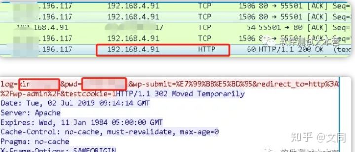
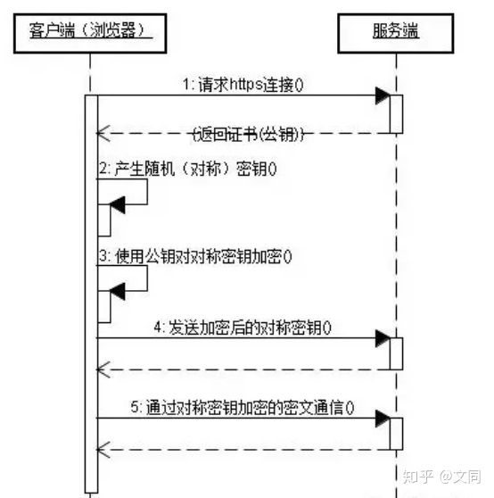

## 1.什么是协议？
网络协议是计算机之间为了实现网络通信而达成的一种“约定”或者”规则“，有了这种”约定“，不同厂商的生产设备，以及不同操作系统组成的计算机之间，就可以实现通信。

## 2.HTTP协议是什么？
HTTP协议是超文本传输协议的缩写，英文是Hyper Text Transfer Protocol。它是从WEB服务器传输超文本标记语言(HTML)到本地浏览器的传送协议。

设计HTTP最初的目的是为了提供一种发布和接收HTML页面的方法。

HTPP有多个版本，目前广泛使用的是HTTP/1.1版本。

## 3.HTTP原理
HTTP是一个基于TCP/IP通信协议来传递数据的协议，传输的数据类型为HTML 文件,、图片文件, 查询结果等。

HTTP协议一般用于B/S架构（）。浏览器作为HTTP客户端通过URL向HTTP服务端即WEB服务器发送所有请求。

## 4.HTTP特点
1. http协议支持客户端/服务端模式，也是一种请求/响应模式的协议。
2. 简单快速：客户向服务器请求服务时，只需传送请求方法和路径。请求方法常用的有GET、HEAD、POST。
3. 灵活：HTTP允许传输任意类型的数据对象。传输的类型由Content-Type加以标记。
4. 无连接：限制每次连接只处理一个请求。服务器处理完请求，并收到客户的应答后，即断开连接，但是却不利于客户端与服务器保持会话连接，为了弥补这种不足，产生了两项记录http状态的技术，一个叫做Cookie,一个叫做Session。
5. 无状态：无状态是指协议对于事务处理没有记忆，后续处理需要前面的信息，则必须重传。

## 5.URI和URL的区别
HTTP使用统一资源标识符（Uniform Resource Identifiers, URI）来传输数据和建立连接。

- URI：Uniform Resource Identifier 统一资源标识符
- URL：Uniform Resource Location 统一资源定位符

URI 是用来标示 一个具体的资源的，我们可以通过 URI 知道一个资源是什么。
URL 则是用来定位具体的资源的，标示了一个具体的资源位置。互联网上的每个文件都有一个唯一的URL。

## 6.HTTP报文组成
#### 请求报文构成
- 请求行：包括请求方法、URL、协议/版本
- 请求头(Request Header)
- 请求正文

#### 响应报文构成
- 状态行
- 响应头
- 响应正文

## 7.常见请求方法
- GET:请求指定的页面信息，并返回实体主体。
- POST:向指定资源提交数据进行处理请求（例如提交表单或者上传文件）。数据被包含在请求体中。POST请求可能会导致新的资源的建立和/或已有资源的修改。
- HEAD:类似于get请求，只不过返回的响应中没有具体的内容，用于获取报头
- PUT:从客户端向服务器传送的数据取代指定的文档的内容。
- DELETE:请求服务器删除指定的页面。

#### post和get的区别：
- 都包含请求头请求行，post多了请求body。
- get多用来查询，请求参数放在url中，不会对服务器上的内容产生作用。post用来提交，如把账号密码放入body中。
- GET是直接添加到URL后面的，直接就可以在URL中看到内容，而POST是放在报文内部的，用户无法直接看到。
- GET提交的数据长度是有限制的，因为URL长度有限制，具体的长度限制视浏览器而定。而POST没有。

## 8.响应状态码
访问一个网页时，浏览器会向web服务器发出请求。此网页所在的服务器会返回一个包含HTTP状态码的信息头用以响应浏览器的请求。
#### 状态码分类：
- 1XX- 信息型，服务器收到请求，需要请求者继续操作。
- 2XX- 成功型，请求成功收到，理解并处理。
- 3XX - 重定向，需要进一步的操作以完成请求。
- 4XX - 客户端错误，请求包含语法错误或无法完成请求。
- 5XX - 服务器错误，服务器在处理请求的过程中发生了错误。

#### 常见状态码：
- 200 OK - 客户端请求成功
- 301 - 资源（网页等）被永久转移到其它URL
- 302 - 临时跳转
- 400 Bad Request - 客户端请求有语法错误，不能被服务器所理解
- 401 Unauthorized - 请求未经授权，这个状态代码必须和WWW-Authenticate报头域一起使用
- 404 - 请求资源不存在，可能是输入了错误的URL
- 500 - 服务器内部发生了不可预期的错误
- 503 Server Unavailable - 服务器当前不能处理客户端的请求，一段时间后可能恢复正常。

## 9.为什么要用https？
实际使用中，绝大说的网站现在都采用的是https协议，这也是未来互联网发展的趋势。下面是通过wireshark抓取的一个博客网站的登录请求过程。

可以看到访问的账号密码都是明文传输， 这样客户端发出的请求很容易被不法分子截取利用，因此，HTTP协议不适合传输一些敏感信息，比如：各种账号、密码等信息，使用http协议传输隐私信息非常不安全。

### 一般http中存在如下问题：
- 请求信息明文传输，容易被窃听截取。
- 数据的完整性未校验，容易被篡改
- 没有验证对方身份，存在冒充危险

## 10.什么是HTTPS?
HTTPS 协议（HyperText Transfer Protocol over Secure Socket Layer）：一般理解为HTTP+SSL/TLS，通过 SSL证书来验证服务器的身份，并为浏览器和服务器之间的通信进行加密。

- 首先客户端通过URL访问服务器建立SSL连接。
- 服务端收到客户端请求后，会将网站支持的证书信息（证书中包含公钥）传送一份给客户端。
- 客户端的服务器开始协商SSL连接的安全等级，也就是信息加密的等级。
- 客户端的浏览器根据双方同意的安全等级，建立会话密钥，然后利用网站的公钥将会话密钥加密，并传送给网站。
- 服务器利用自己的私钥解密出会话密钥。
- 服务器利用会话密钥加密与客户端之间的通信。

### HTTPS的缺点
HTTPS协议多次握手，导致页面的加载时间延长近50%；
HTTPS连接缓存不如HTTP高效，会增加数据开销和功耗；
申请SSL证书需要钱，功能越强大的证书费用越高。
SSL涉及到的安全算法会消耗 CPU 资源，对服务器资源消耗较大。

#  http和https的区别与联系
- HTTPS是HTTP协议的安全版本，HTTP协议的数据传输是明文的，是不安全的，HTTPS使用了SSL/TLS协议进行了加密处理。
- http和https使用连接方式不同，默认端口也不一样，http是80，https是443。