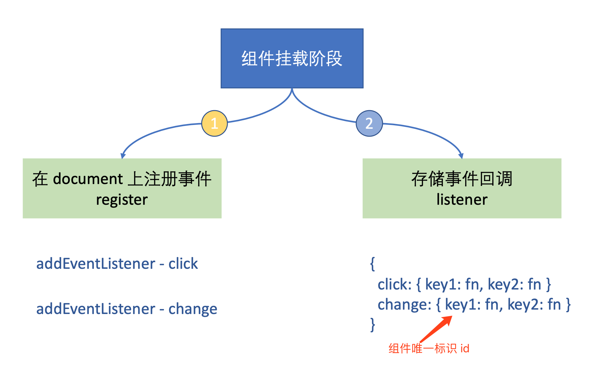

# react事件机制

React 根据W3C 规范来定义自己的事件系统，其事件被称之为合成事件 (SyntheticEvent)。而其自定义事件系统的动机主要包含以下几个方面：

（1）抹平不同浏览器之间的兼容性差异。最主要的动机。

（2）事件"合成"，即事件自定义。事件合成既可以处理兼容性问题，也可以用来自定义事件（例如 React 的 onChange 事件）。

（3）提供一个抽象跨平台事件机制。类似 VirtualDOM 抽象了跨平台的渲染方式，合成事件（SyntheticEvent）提供一个抽象的跨平台事件机制。

（4）可以做更多优化。例如利用事件委托机制，几乎所有事件的触发都代理到了 document，而不是 DOM 节点本身，简化了 DOM 事件处理逻辑，减少了内存开销。（React 自身模拟了一套事件冒泡的机制）

（5）可以干预事件的分发。V16引入 Fiber 架构，React 可以通过干预事件的分发以优化用户的交互体验。

## 事件注册

React 的事件注册过程主要做了两件事：document 上注册、存储事件回调。

### 1. document 上注册
在 React 组件挂载阶段，根据组件内的声明的事件类型（onclick、onchange 等），在 document 上注册事件（使用addEventListener），并指定统一的回调函数 dispatchEvent。换句话说，document 上不管注册的是什么事件，都具有统一的回调函数 dispatchEvent。也正是因为这一事件委托机制，具有同样的回调函数 dispatchEvent，所以对于同一种事件类型，不论在 document 上注册了几次，最终也只会保留一个有效实例，这能减少内存开销。

### 2. 事件分发

事件分发也就是事件触发。React 的事件触发只会发生在 DOM 事件流的冒泡阶段，因为在 document 上注册时就默认是在冒泡阶段被触发执行。

其大致流程如下：

1. 触发事件，开始 DOM 事件流，先后经过三个阶段：事件捕获阶段、处于目标阶段和事件冒泡阶段
2. 当事件冒泡到 document 时，触发统一的事件分发函数 ReactEventListener.dispatchEvent
3. 根据原生事件对象（nativeEvent）找到当前节点（即事件触发节点）对应的 ReactDOMComponent 对象
4. 事件的合成
> 根据当前事件类型生成对应的合成对象
> 封装原生事件对象和冒泡机制
> 查找当前元素以及它所有父级
> 在 listenerBank 中查找事件回调函数并合成到 events 中
5. 批量执行合成事件（events）内的回调函数
6. 如果没有阻止冒泡，会将继续进行 DOM 事件流的冒泡（从 document 到 window），否则结束事件触发

[参考链接](https://www.cnblogs.com/forcheng/p/13187388.html)