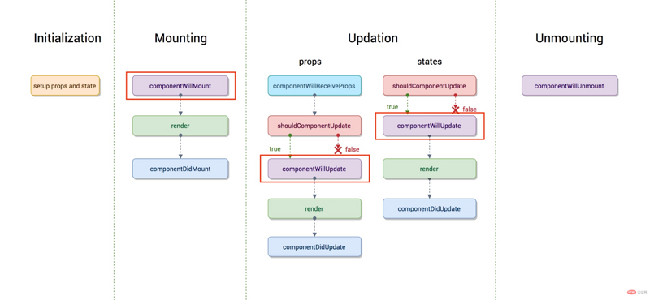
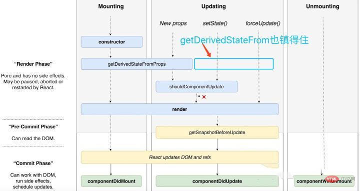
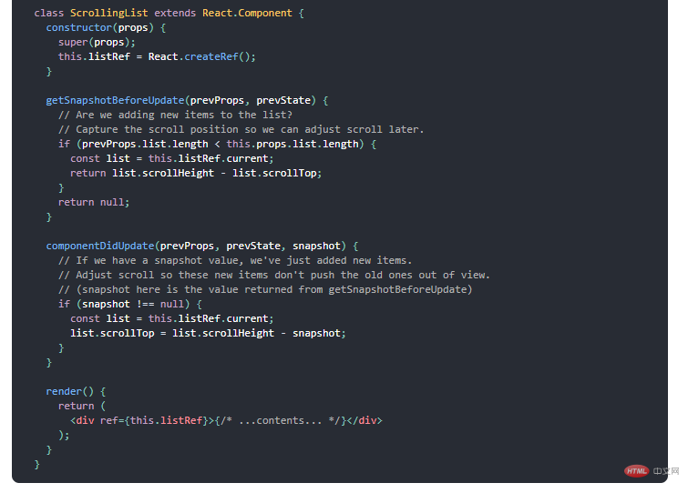

## react生命周期
* constructor:
     > 构造函数，在创建组件的时候调用一次  
     > 组件初始化开始  
     > 初始化state  

* getDefaultProps:
     > 设置默认的props,也可以用defaultProps设置组件的默认属性  

* getInitialState:
     > 初始化state, 可以直接在constructor中定义this.state  

* componentWillMount:
     > 组件将要挂在，组件加载时调用，以后组件更新不调用，整个生命周期只调用一次，此时可以修改state  
     > 已经可以读到state数据  
     > 已经在内存中产生虚拟DOM树，但是没有绘制页面上  
     > Tip1: 不建议在次请求数据，由于请求数据接口一般都是异步，这时候render已经被执行，建议在componentDidMount中请求  
     > Tip2: 如果在服务端渲染，该钩子函数被调用两次，一次服务端，一次浏览器端，而componentDidMount函数只会在浏览器端请求一次  

* render:
     > react最重要的步骤，创建虚拟dom， 进行diff算法，更新dom树都在此进行  
     > Tip： 记住，不要在render里面修改state  

* componentDiDMount:
     > 所有的组件（包括自组件）在render执行之后立即调用，并且只会被调用一次  
     > 组件已经初始化完成  
     > DOM树渲染完成  
     > Tip: 建议在次请求数据  

## 这个React 16之后有三个生命周期被废弃(但并未删除)
* componentWillReceiveProps(nextProps){}:
     > props的数据发生改变的时候触发，在该函数内部this.props 属性还没改变的时候发生，但是可以通过第一个参数nextProps获取到的修改之后的props属性  
     > 在props被改变时触发，初始化render时不调用  
     > Tip1: 某些情况下，props没变也会触发该钩子函数，需要在方法里手动判断一下this.props和nextProps是否相同，不相同了才执行我的更新方法  
     > Tip2: 该函数一般用来更新依赖props的状态  

* shouldComponentUpdate(nextProps, nextState) {}:
     > 组件接收到新的props或者state时调用，return true就会更新dom（使用diff算法更新），return false 能阻止更新（不调用render）  
     > 在函数内部state 和props还未改变，新的props和state在两个参数内  
     > 该方法并不会在初始化渲染或者使用forceUpdate（）时调用。  

* componentWillUpdate(nextProps, nextState) {}:
     > shoudComponentUpdate 返回true 或者调用forceUpdate之后，componentWillUpdate会被调用  
     > 数据修改， 接着执行render  

* getSnapshotBeforeUpdate(prevProps, prevState) {}:
     > 触发时间： update发生的时候， 在render之后，在组件dom渲染之前；返回一个值，作为componentDidUpdate的第三个参数；  
     > 该函数在最新的渲染输出提交给DOM前将立即调用，它让你的组件能在当前的值要改变前获取它们。这一生命周期返回的任何值会 作为参数被传递给componentDidUpdate（）  

* componentDidUpdate(prevProps, prevState) {}:
     > 数据修改成功，组件更新完成后调用  
     > 除了首次render之后调用componentDidMount,其他render结束之后都会调用componentDidUpdate  
     > 通过prevProps和prevState访问修改之前的props和state  

* componentWillUnmount:
     > 在组件被卸载和销毁前立即调用。可以在该方法里处理任何必要的清理工作，例如解绑定时器，取消网络请求，清理任何在componentDidMount环节创建的DOM元素  

* componentDidCatch(error, info) {}:
     > 该函数为错误边界， 捕获发生咋子组件树中任何地方的JS错误，打印错误日志，并且显示回退的用户边界。  
     > Tip：错误边界只捕获树中发生在它们之下的组件里的错误。一个错误边界并不能捕获它自己的内部错误。  

1、React16新的生命周期弃用了componentWillMount、componentWillReceivePorps，componentWillUpdate
2、新增了getDerivedStateFromProps、getSnapshotBeforeUpdate来代替弃用的三个钩子函数（componentWillMount、componentWillReceivePorps，componentWillUpdate）
3、React16并没有删除这三个钩子函数，但是不能和新增的钩子函数（getDerivedStateFromProps、getSnapshotBeforeUpdate）混用，React17将会删除componentWillMount、componentWillReceivePorps，componentWillUpdate
4、新增了对错误的处理（componentDidCatch
    ———————————————

[值得阅读](https://segmentfault.com/a/1190000021272657)

## 为什么废弃react生命周期函数？
新的生命周期增加了static getDerivedStateFromProps()以及getSnapshotBeforeUpdate()，废弃了原有的componentWillMount()、componentWillUpdate()以及componentWillReceiveProps()

原生命周期：


新生命周期（图引用自React v16.3之后的组件生命周期函数）：


为什么数据获取要在componentDidMount中进行?
作者一开始也喜欢在React的willMount函数中进行异步获取数据（认为这可以减少白屏的时间），后来发现其实应该在didMount中进行。

首先，分析一下两者请求数据的区别：

### componentWillMount获取数据：

1. 执行willMount函数，等待数据返回
2. 执行render函数
3. 执行didMount函数
4. 数据返回， 执行render
5. didMount获取数据：

### didMount获取数据：
- 执行willMount函数
- 执行render函数
- 执行didMount函数， 等待数据返回
- 数据返回， 执行render
- 很明显，在willMount中获取数据，可以节省时间（render函数和didMount函数的执行时间），但是为什么我们还要在didMount中获取数据

如果使用服务端渲染的话，willMount会在服务端和客户端各自执行一次，这会导致请求两次（接受不了~），而didMount只会在客户端进行
**在Fiber之后， 由于任务可中断，willMount可能会被执行多次(fiber算法是异步渲染，异步的渲染，很可能因为高优先级任务的出现而打断现有任务导致componentWillMount就可能执行多次)**
willMount会被废弃，目前被标记为不安全
节省的时间非常少，跟其他的延迟情况相比，这个优化可以使用九牛一毛的形容（为了这么一点时间而一直不跟进技术的发展，得不偿失），并且render函数是肯定比异步数据到达先执行，白屏时间并不能减少
关于第一点，如果你想在服务端渲染时先完成数据的展示再一次性给用户，官方的推荐做法是用constructor代替willMount


## 为什么要改变生命周期
从上面的生命周期的图中可以看出，被废弃的三个函数都是在render之前，因为fiber的出现，很可能因为高优先级任务的出现而打断现有任务导致它们会被执行多次

另外的一个原因则是，React想约束使用者，好的框架能够让人不得已写出容易维护和扩展的代码，这一点又是从何谈起，我们可以从新增加以及即将废弃的生命周期分析入手

### componentWillMount（）
首先这个函数的功能完全可以使用componentDidMount和constructor来代替，异步获取的数据的情况上面已经说明了，而如果抛去异步获取数据，其余的即是初始化而已，这些功能都可以在constructor中执行，除此之外，如果我们在willMount中订阅事件，但在服务端这并不会执行willUnMount事件，也就是说服务端会导致内存泄漏

所以componentWillMount完全可以不使用，但使用者有时候难免因为各种各样的情况（如作者犯浑）在componentWillMount中做一些操作，那么React为了约束开发者，干脆就抛掉了这个API

### componentWillReceiveProps
在老版本的 React 中，如果组件自身的某个 state 跟其 props 密切相关的话，一直都没有一种很优雅的处理方式去更新 state，而是需要在 componentWillReceiveProps 中判断前后两个 props 是否相同，如果不同再将新的 props 更新到相应的 state 上去。这样做一来会破坏 state 数据的单一数据源，导致组件状态变得不可预测，另一方面也会增加组件的重绘次数。类似的业务需求也有很多，如一个可以横向滑动的列表，当前高亮的 Tab 显然隶属于列表自身的状态，但很多情况下，业务需求会要求从外部跳转至列表时，根据传入的某个值，直接定位到某个 Tab。
本段引用自React v16.3 版本新生命周期函数浅析及升级方案

为了解决这些问题，React引入了第一个新的生命周期
```js
static getDerivedStateFromProps(nextProps, prevState) .//返回一个对象 和调用setState一样
```

可以先看一下两者在使用上的区别：
```js
     componentWillReceiveProps(nextProps){
          if(nextProps.tab!=this.props.tab){
               this.setState({
               tab:nextProps.tab
          });
          this.tabChange();
     }
     }
```

新的代码
```js
     static getDerivedStateFromPorps (nextProps,prevState){
     //2
     if(nextProps.tab!=prevState.tab){
          return {
               tab:nextProps.tab
          };
     }
          return null;
     }

     componentDidUpdate(prevProps,prevState){
          this.tabChange();
     }
```
这样看似乎没有什么改变，特别是当我们把this,tabChange也放在didUpdate中执行时（正确做法），完全没有不同，但这也是我们一开始想说的，React通过API来约束开发者写出更好的代码，而新的使用方法有以下的优点

- getDSFP是静态方法，在这里不能使用this，也就是一个纯函数，开发者不能写出副作用的代码
- 开发者只能通过prevState而不是prevProps来做对比，保证了state和props之间的简单关系以及不需要处理第一次渲染时prevProps为空的情况
- 基于第一点，将状态变化（setState）和昂贵操作（tabChange）区分开，更加便于 render 和 commit 阶段操作或者说优化。

componentWillUpdate（）
与 componentWillReceiveProps 类似，许多开发者也会在 componentWillUpdate 中根据 props 的变化去触发一些回调。但不论是 componentWillReceiveProps 还是 componentWillUpdate，都有可能在一次更新中被调用多次，也就是说写在这里的回调函数也有可能会被调用多次，这显然是不可取的。与 componentDidMount 类似，componentDidUpdate 也不存在这样的问题，一次更新中 componentDidUpdate 只会被调用一次，所以将原先写在 componentWillUpdate 中的回调迁移至 componentDidUpdate 就可以解决这个问题。
本段引用自React v16.3 版本新生命周期函数浅析及升级方案

另外一种情况则是我们需要获取DOM元素状态，但是由于在fiber中，render可打断，可能在willMount中获取到的元素状态很可能与实际需要的不同，这个通常可以使用第二个新增的生命函数的解决

```js
getSnapshotBeforeUpdate(prevProps, prevState) // 返回的值作为componentDidUpdate的第三个参数
```

与willMount不同的是， getSnapshotBeforeUpdate会在最终确定的render执行之前执行，也就是能保证其获取到的元素状态与didUpdate中获取到的元素状态相同，这里官方提供了一段参考代码：


总结：

随着React Fiber的落地，许多功能都将开始改变，但本质上是换汤不换药，很多时候都是React为了开发者写出更好的代码而做的改变，当然这也是React的厉害之处，通过框架来约束开发者！