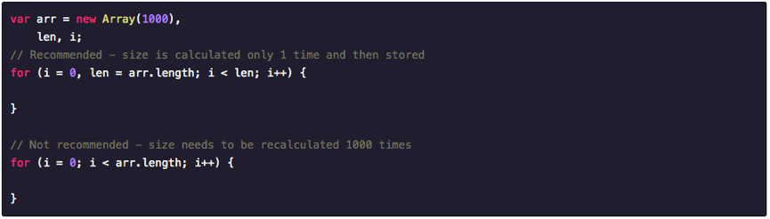
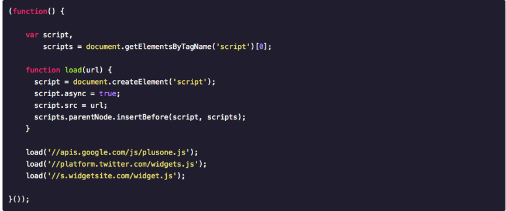

# 前端开发规范参考文档
* [基本原则](#基本原则)

[1. 结构、样式、行为分离](#1-结构、样式、行为分离)

[4-对象的属性和方法间保留空行](#4-对象的属性和方法间保留空行)
## 基本原则
### 1. 结构、样式、行为分离
尽量确保文档和模板只包含 HTML 结构，样式都放到样式表里，行为都放到脚本里。
### 2. 缩进
统一两个空格缩进（总之缩进统一即可）
### 3. 统一注释

## JavaScript
### 1. 缓存数组长度
循环无疑是和 JavaScript 性能非常相关的一部分。通过存储数组的长度，可以有效避免每次循环重新计算。
注: 虽然现代浏览器引擎会自动优化这个过程，但是不要忘记还有旧的浏览器。



### 2. 异步加载第三方内容
当你无法保证嵌入第三方内容比如 Youtube 视频或者一个 like/tweet 按钮可以正常工作的时候，你需要考虑用异步加载这些代码，避免阻塞整个页面加载。



### 3. 不同行为或逻辑的语句集，使用空行隔开，更易阅读
```js
function setStyle(element, property, value) {
  if (element == null) return

  element.style[property] = value
}
```

### 4. 对象的属性和方法间保留空行
```js
// bad
const obj = {
  foo() {
  },
  bar() {
  }
}

// good
const obj = {
  foo() {
  },

  bar() {
  }
}
```
