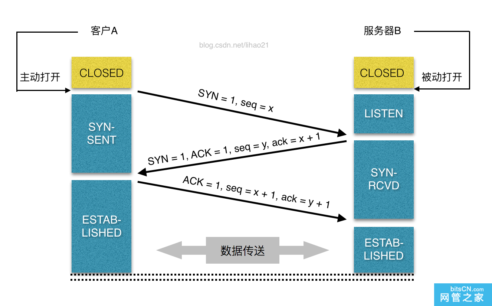
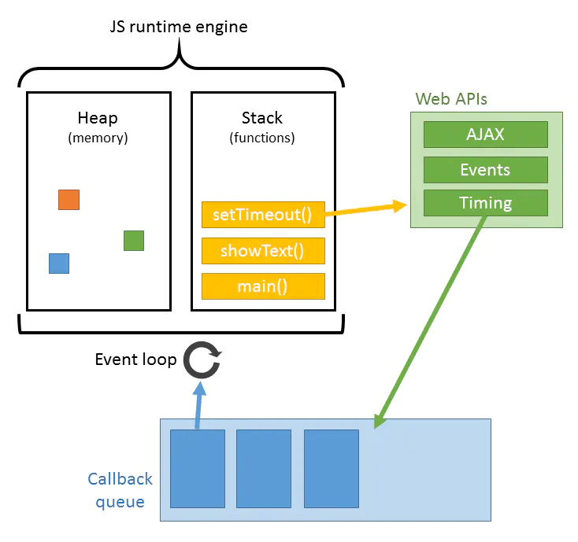

# 从输入 url 到展示的过程

1. DNS解析

2. TCP连接（三次握手）

3. 发送HTTP请求 （https 非对称／对称 身份认证，对称秘钥传输）

4. 服务器处理请求并返回HTTP报文

5. 浏览器解析渲染页面

6. 连接结束（四次挥手）


## DNS解析

**查找顺序： 浏览器缓存--> 操作系统缓存--> 本地host文件 --> 路由器缓存--> ISP DNS缓存 --> 顶级DNS服务器/根DNS服务器**


## 建立TCP连接



## 发送HTTP请求
> 建立了TCP连接之后，发起一个http请求。一个典型的 http request header 一般需要包括请求的方法，例如 GET 或者 POST 等，不常用的还有 PUT 和 DELETE 、HEAD、OPTION以及 TRACE 方法，一般的浏览器只能发起 GET 或者 POST 请求。  

客户端向服务器发起http请求的时候，会有一些请求信息，请求信息包含三个部分：

* 请求方法URI协议/版本
* 请求头(Request Header)
* 请求正文：

## 服务器处理请求

## 服务器返回一个 HTTP 响应 

> 经过前面的6个步骤，服务器收到了我们的请求，也处理我们的请求，到这一步，它会把它的处理结果返回，也就是返回一个HTPP响应。 HTTP响应与HTTP请求相似，HTTP响应也由3个部分构成，分别是：
* 状态行
* 响应头(Response Header)
* 空行
* 响应正文

```js
    HTTP/1.1 200 OK
    Date: Sat, 31 Dec 2005 23:59:59 GMT
    Content-Type: text/html;charset=ISO-8859-1
    Content-Length: 122

    ＜html＞
    ＜head＞
    ＜title＞http＜/title＞
    ＜/head＞
    ＜body＞
    ＜!-- body goes here --＞
    ＜/body＞
    ＜/html＞
```

## 浏览器显示 HTML

> 浏览器在收到HTML,CSS,JS文件后，它是如何把页面呈现到屏幕上的？下图对应的就是WebKit渲染的过程。
**构建dom树 -> 构建render树 -> 布局render树 -> 绘制render树**

### 渲染过程：
​	浏览器是一个边解析边渲染的过程。首先浏览器解析HTML文件构建DOM树，然后解析CSS文件构建渲染树，等到渲染树构建完成后，浏览器开始布局渲染树并将其绘制到屏幕上。这个过程比较复杂，涉及到两个概念: reflow(回流)和repain(重绘)。DOM节点中的各个元素都是以盒模型的形式存在，这些都需要浏览器去计算其位置和大小等，这个过程称为relow;当盒模型的位置,大小以及其他属性，如颜色,字体,等确定下来之后，浏览器便开始绘制内容，这个过程称为repain。页面在首次加载时必然会经历reflow和repain。reflow和repain过程是非常消耗性能的，尤其是在移动设备上，它会破坏用户体验，有时会造成页面卡顿。所以我们应该尽可能少的减少reflow和repain。


​	当文档加载过程中遇到js文件，html文档会挂起渲染（加载解析渲染同步）的线程，不仅要等待文档中js文件加载完毕，还要等待解析执行完毕，才可以恢复html文档的渲染线程。因为JS有可能会修改DOM，最为经典的document.write，这意味着，在JS执行完成前，后续所有资源的下载可能是没有必要的，这是js阻塞后续资源下载的根本原因。所以我明平时的代码中，js是放在html文档末尾的。


​	JS的解析是由浏览器中的JS解析引擎完成的。JS是单线程运行，也就是说，在同一个时间内只能做一件事，所有的任务都需要排队，前一个任务结束，后一个任务才能开始。但是又存在某些任务比较耗时，如IO读写等，所以需要一种机制可以先执行排在后面的任务，这就是：同步任务(synchronous)和异步任务(asynchronous)。


​	JS的执行机制就可以看做是一个主线程加上一个任务队列(task queue)。同步任务就是放在主线程上执行的任务，异步任务是放在任务队列中的任务。所有的同步任务在主线程上执行，形成一个执行栈;异步任务有了运行结果就会在任务队列中放置一个事件；脚本运行时先依次运行执行栈，然后会从任务队列里提取事件，运行任务队列中的任务，这个过程是不断重复的，所以又叫做事件循环(Event loop)。



## 连接结束
现在的页面为了优化请求的耗时，默认都会开启持久连接（keep-alive），那么一个TCP连接确切关闭的时机，是这个tab标签页关闭的时候。这个关闭的过程就是著名的四次挥手。关闭是一个全双工的过程，发包的顺序的不一定的。一般来说是客户端主动发起的关闭，过程如下。

对于一个已经建立的连接，TCP使用改进的三次握手来释放连接（使用一个带有FIN附加标记的报文段）。TCP关闭连接的步骤如下：
1. 当主机A的应用程序通知TCP数据已经发送完毕时，TCP向主机B发送一个带有FIN附加标记的报文段（FIN表示英文finish）。
2. 主机B收到这个FIN报文段之后，并不立即用FIN报文段回复主机A，而是先向主机A发送一个确认序号ACK，同时通知自己相应的应用程序：对方要求关闭连接（先发送ACK的目的是为了防止在这段时间内，对方重传FIN报文段）。
3. 主机B的应用程序告诉TCP：我要彻底的关闭连接，TCP向主机A送一个FIN报文段。
4. 主机A收到这个FIN报文段后，向主机B发送一个ACK表示连接彻底释放。


**补充**
### 为什么连接的时候是三次握手，关闭的时候却是四次握手？
答：因为当Server端收到Client端的SYN连接请求报文后，可以直接发送SYN+ACK报文。其中ACK报文是用来应答的，SYN报文是用来同步的。但是关闭连接时，当Server端收到FIN报文时，很可能并不会立即关闭SOCKET，所以只能先回复一个ACK报文，告诉Client端，"你发的FIN报文我收到了"。只有等到我Server端所有的报文都发送完了，我才能发送FIN报文，因此不能一起发送。故需要四步握手。